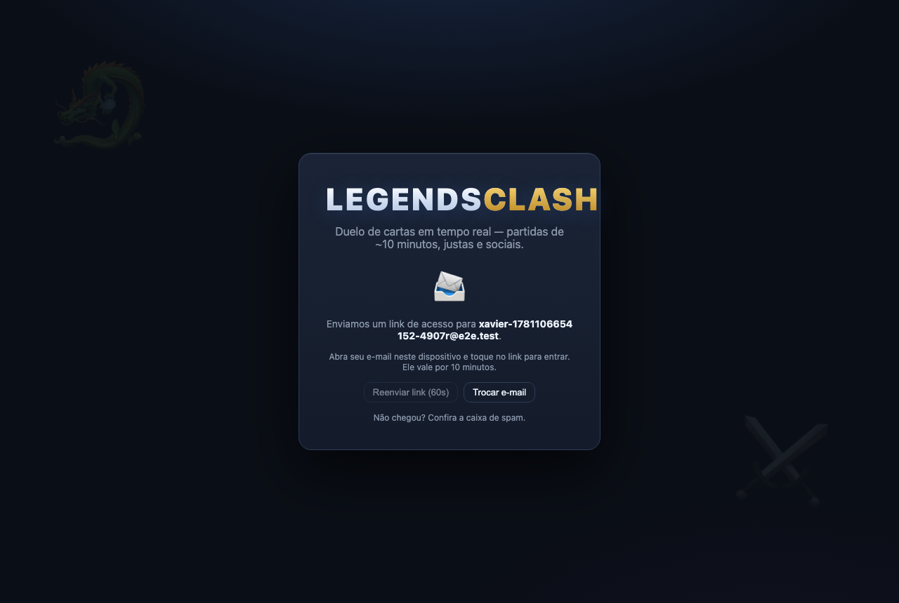
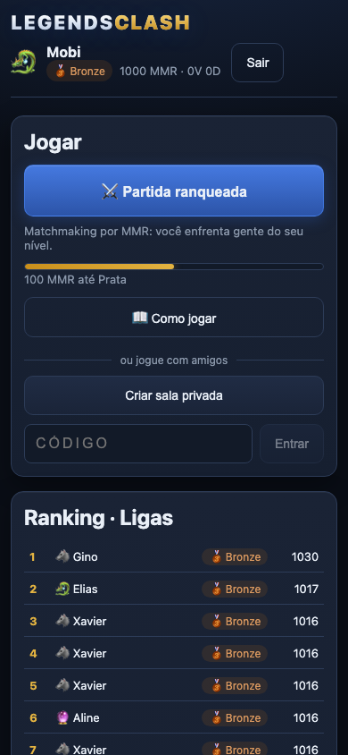

# ⚔️ Legends Clash — MVP

Jogo de cartas digital multiplayer, **em tempo real, para web** — MVP funcional da proposta de
produto (case "Legends Clash"). Partidas 1v1 de ~10 minutos, justas e sociais, sobre uma
arquitetura pronta para 2+ jogadores.

## Como rodar

Requisitos: Node.js 20+.

```bash
npm install

# produção local (cliente compilado servido pelo próprio servidor)
npm run build
npm start            # → http://localhost:8787

# ou desenvolvimento (dois terminais, com hot reload)
npm run dev:server   # API + WebSocket em :8787
npm run dev:client   # Vite em :5173 (proxy para :8787)
```

### Backend / persistência (Supabase)

O servidor é autoritativo e persiste em **PostgreSQL no Supabase** via *write-through*
assíncrono — clientes nunca tocam o banco (anti-cheat). Configure o `.env` na raiz a
partir do `.env.example`:

```bash
SUPABASE_URL=https://<projeto>.supabase.co
SUPABASE_SERVICE_ROLE_KEY=<service_role>   # somente o servidor usa a service role
```

O schema vive em `supabase/migrations/`; aplique com `supabase db push` (ou pelo SQL
Editor). Sem essas variáveis, o servidor cai automaticamente num snapshot JSON local,
ideal para desenvolvimento e testes.

> **Modo local forçado:** com o `.env` preenchido, `LC_LOCAL=1 npm start` (ou
> `npm run dev:server`) ignora o Supabase — snapshot JSON + códigos OTP no console —
> para desenvolver sem tocar o banco de produção. Os testes e2e já rodam assim.

### Login por link mágico e sessões

O login é **sem senha**: o jogador informa o e-mail e recebe um **link de acesso**
(Supabase Auth). O link passa pelo verificador do Supabase e volta para
**`APP_BASE_URL/auth/callback`** com um JWT de vida curta no fragment; o cliente
troca esse JWT em `POST /api/auth/link` por uma **sessão do servidor** — token opaco
de 32 bytes guardado como sha-256 na tabela `sessions`, com expiração deslizante de
30 dias, multi-dispositivo e revogação no logout. O cliente nunca fala com o
Supabase: o servidor media tudo (`/api/auth/otp`, `/link`, `/verify`, `/profile`,
`/logout`) com rate-limit por e-mail (60 s) e por IP. O caminho por **código de 6
dígitos** (`/verify`) continua aceito pela API — o e-mail passa a exibi-lo quando
houver SMTP próprio com template customizado.

- **`APP_BASE_URL`** define o destino do link (padrão:
  `https://srv1745709.hstgr.cloud`); em dev com Supabase real use
  `http://localhost:8787`.
- No modo local (`LC_LOCAL=1`) nada de e-mail: o **link de acesso aparece no
  console** do servidor (com código embutido) e, fora de produção,
  `GET /api/auth/dev-code?email=...` o expõe para os testes.

Configuração no Supabase (já aplicada via Management API; para reproduzir):

1. **Auth → URL Configuration**: `Site URL = https://srv1745709.hstgr.cloud` e
   *Redirect URLs* com `https://srv1745709.hstgr.cloud/auth/callback` (+ as
   variantes `http://localhost:8787/...` e `:5173/...` para dev).
2. **Auth → Providers → Email**: habilitado, com signups permitidos.
3. Expiração do OTP/link: 600 s; código com 6 dígitos.

> **SMTP próprio (ex.: Resend) é recomendado para o lançamento:** o remetente
> embutido do Supabase é limitado a poucos e-mails por hora e o template padrão é
> em inglês (não customizável no plano free sem SMTP). O fluxo por link **funciona
> com o template padrão**; com SMTP dá para traduzir o e-mail e incluir também o
> código de 6 dígitos como alternativa.

Para jogar uma partida: abra duas janelas (uma anônima), entre com dois e-mails diferentes e
use **Partida ranqueada** nas duas — o matchmaking pareia em até 2 s — ou crie uma **sala
privada** e entre na outra janela pelo link de convite (`/room/CÓDIGO`).

```bash
npm test             # testes do motor de jogo, Elo, matchmaking e filtro de chat
npm run typecheck

# e2e com navegadores reais (na primeira vez: npx playwright install chromium)
npm run build && npm run test:e2e
```

## A partida em imagens

Capturas de **partidas reais** geradas pelos testes e2e (dois navegadores jogando um contra o outro):

| | |
| --- | --- |
|  |  |
| Login sem senha: e-mail… | …e um link mágico chega na caixa de entrada |
|  |  |
| Home: ranqueada, salas, ranking e progresso de liga | Sala privada com convite por link e chat moderado |
|  |  |
| Início de partida: mãos de 5, 30 de vida | Arrasto de mira com prévia de dano em cada alvo |
|  |  |
| Vitória por vida zerada: confete e Elo +16 | **Mobile de primeira classe**: responsivo + jogabilidade por toque |

## Escopo do MVP (slide "MVP — 90 dias") → implementação

| Proposta | Implementação |
| --- | --- |
| **Login e perfil** | **Link mágico por e-mail** (Supabase Auth) + sessões revogáveis de 30 dias; perfil (nome + avatar) no primeiro acesso, com MMR, liga, V/D e histórico. Google OAuth é fase *Next* (o vínculo `auth_user_id` já existe). |
| **Lobby** | Criar sala, entrar por código e **convidar por link** (`/room/CÓDIGO`) — a alavanca de viralidade. |
| **Matchmaking** | Fila por **MMR (Elo)** com janela de pareamento que expande com a espera — novatos nunca enfrentam veteranos de cara. |
| **Gameplay core** | Deck padrão de 30 cartas, turnos em 5 fases, **motor de regras autoritativo no servidor**, vitória por vida zerada / abandono / timeout. |
| **Chat de texto** | Filtro de palavras (com normalização de acentos e leet), **mute** e **report** — moderação nasce no MVP. |
| **Ranking simples** | Três ligas — **Bronze, Prata e Ouro** — derivadas do MMR, com leaderboard. |

### Mecânica (slides "Mecânica")

- **1v1**, 30 de vida, deck de 30 cartas, mão inicial de 4 (quem joga depois compra 1 extra).
- Turno em 5 fases: **Compra → Energia (+1, máx. 10) → Ação → Combate → Encerra**, com
  temporizador de 60 s por turno (o servidor passa a vez automaticamente).
- Quatro tipos de carta: **criaturas** (ataque/defesa, enjoo de invocação), **magias**
  (dano, cura, buff), **artefatos** (escudo, bônus passivo de ataque) e **táticas**
  (compra, energia, devolver criatura).
- **Proteção do comandante** (dinâmica inspirada em Yu-Gi-Oh): enquanto houver
  criatura inimiga em campo, nem ataques nem magias podem mirar a vida do
  comandante. Ao destruir a **última** criatura, o **dano excedente** do golpe
  atravessa e desconta dos pontos de vida (escudo absorve primeiro). Efeitos
  especiais marcados como dano direto (`pierce`) ignoram a proteção — espaço de
  design para expansões. **Provocar** define a prioridade entre criaturas.
- Deck vazio causa **fadiga** crescente — partidas não se arrastam.

### Fairness por design (slide "Fairness por design")

- **Sem pay-to-win**: não existe compra de cartas; todos jogam com o mesmo deck balanceado
  (o que também isola a variável "diversão" na validação — slide "O que fica fora do MVP").
- **Anti-abandono**: 2 minutos para reconectar; vitória automática do oponente só após a
  janela; o temporizador de turno mantém a partida fluindo enquanto isso.
- **Anti-cheat**: o cliente só envia intenções; toda regra é validada no servidor e cada
  jogador recebe uma **visão redigida** (a mão do oponente nunca trafega para o cliente).

### Arquitetura N-player (slide "por que 1v1 primeiro")

O briefing pede "dois ou mais jogadores"; o MVP valida com 1v1, mas a arquitetura nasce
N-player: salas modeladas por **assentos** e turnos em **fila circular** — 1v1 é o caso
particular N=2. Há testes de motor com 3 jogadores provando a rotação e a eliminação de
assentos. Habilitar 2v2/free-for-all é mudança de configuração + balanceamento, não refatoração.

## Arquitetura

```
shared/   Tipos, protocolo WS e catálogo de cartas — contrato único cliente/servidor
server/   Node.js + TypeScript
  src/game/engine.ts   Motor de regras autoritativo (assentos, fases, combate, reconexão)
  src/matchmaking.ts   Fila por MMR com janela expansiva
  src/rooms.ts         Salas/lobby com código de convite
  src/elo.ts           Rating Elo (K=32) e ligas Bronze/Prata/Ouro
  src/wordfilter.ts    Filtro de chat (acentos + leet speak)
  src/store.ts         Persistência write-through (PostgreSQL/Supabase; fallback JSON)
  src/app.ts           Sessões WebSocket, roteamento e ciclo de vida de partidas
  test/                47 testes (motor, Elo, matchmaking, filtro)
client/   React + TypeScript (Vite) — casca de apresentação, zero regra de jogo
e2e/      Playwright: fluxos com navegadores reais (login, lobby, partida
          completa, reconexão) + spec de contrato no nível do WebSocket
```

Stack conforme o slide "Riscos, mitigação e arquitetura": React + TypeScript, Node.js,
WebSockets. A persistência é **PostgreSQL no Supabase** (write-through assíncrono, com
fallback para snapshot JSON local quando o `.env` não está configurado); a infraestrutura
Docker/AWS + analytics (Mixpanel/PostHog) ficam para o beta fechado (sprint 7).

## Créditos de arte

A arte das cartas usa ícones de fantasia de [game-icons.net](https://game-icons.net)
(licença [CC BY 3.0](https://creativecommons.org/licenses/by/3.0/)), via pacote
`react-icons`. O mapeamento carta → ícone/paleta fica em
`client/src/components/CardArt.tsx` — trocar a arte (por exemplo, por ilustrações
de outro banco de assets livres) é alterar um único arquivo, com fallback de emoji
para cartas sem arte mapeada.

## O que fica fora (decisão de produto, não dívida)

Torneios, marketplace/cosméticos, voice chat, **app mobile nativo**, modo espectador e
deck builder — cada exclusão protege o foco de validar **D7 Retention ≥ 20%** (métrica
norte). Gates de evidência condicionam as fases *Next* (2v2, deck builder) e *Later*
(app nativo, FFA 3–4). A **web mobile**, porém, é primeira classe: layout responsivo
e jogabilidade por toque (arrastar para mirar estilo Hearthstone, tap-tap, prévia de
dano em todos os alvos) já fazem parte do MVP — testadas por e2e em viewport de celular.
