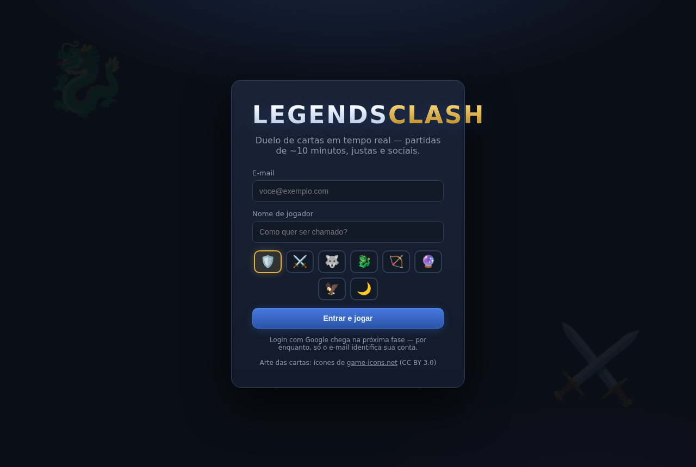
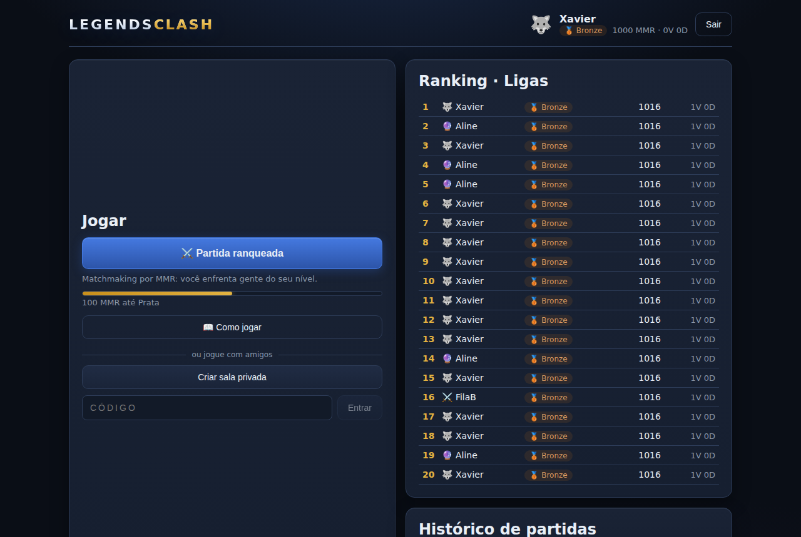
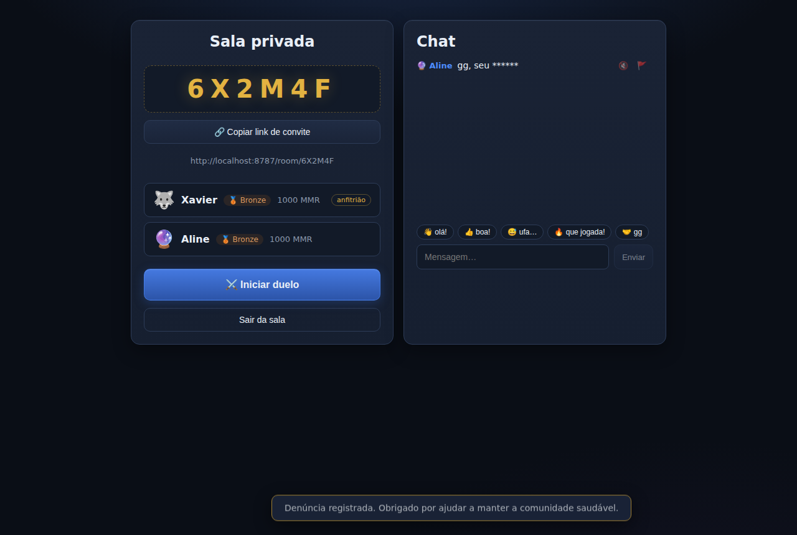
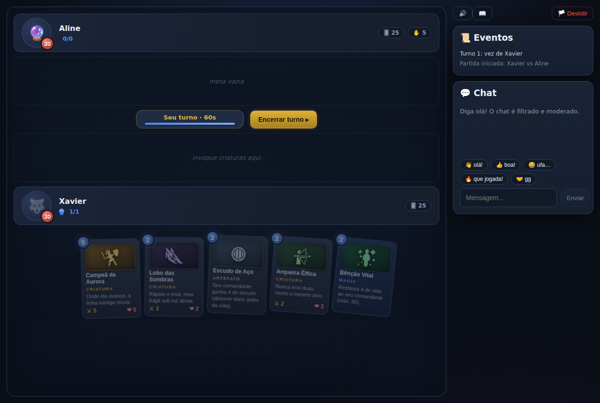
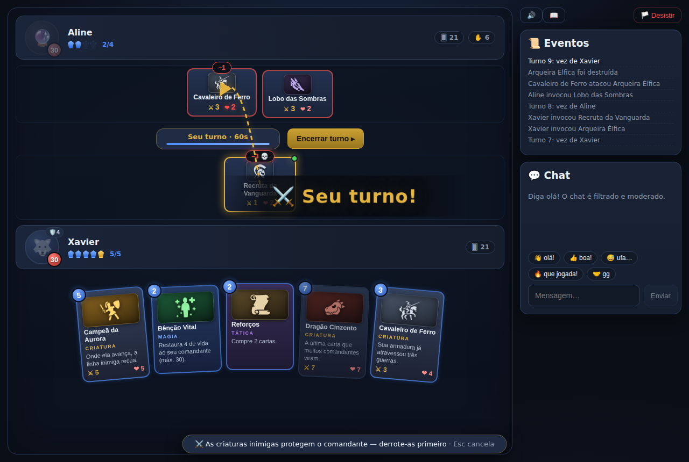
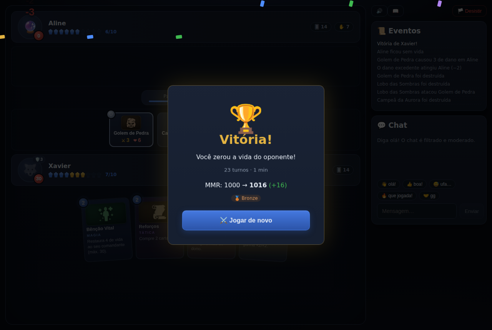

# ⚔️ Legends Clash — MVP

Jogo de cartas digital multiplayer, **em tempo real, para web** — MVP funcional da proposta de
produto (case "Legends Clash"). Partidas 1v1 de ~10 minutos, justas e sociais, sobre uma
arquitetura pronta para 2+ jogadores.

## Como rodar

Requisitos: Node.js 20+.

```bash
npm install

# produção local (cliente compilado servido pelo próprio servidor)
npm run build
npm start            # → http://localhost:8787

# ou desenvolvimento (dois terminais, com hot reload)
npm run dev:server   # API + WebSocket em :8787
npm run dev:client   # Vite em :5173 (proxy para :8787)
```

Para jogar uma partida: abra duas janelas (uma anônima), entre com dois e-mails diferentes e
use **Partida ranqueada** nas duas — o matchmaking pareia em até 2 s — ou crie uma **sala
privada** e entre na outra janela pelo link de convite (`/room/CÓDIGO`).

```bash
npm test             # testes do motor de jogo, Elo, matchmaking e filtro de chat
npm run typecheck

# e2e com navegadores reais (na primeira vez: npx playwright install chromium)
npm run build && npm run test:e2e
```

## A partida em imagens

Capturas de **partidas reais** geradas pelos testes e2e (dois navegadores jogando um contra o outro):

| | |
| --- | --- |
|  |  |
| Login com avatar | Home: ranqueada, salas, ranking e progresso de liga |
|  |  |
| Sala privada com convite por link e chat moderado | Início de partida: mãos de 5, 30 de vida |
|  |  |
| Seta de mira com prévia de dano e banner de turno | Vitória por vida zerada: confete e Elo +16 |

## Escopo do MVP (slide "MVP — 90 dias") → implementação

| Proposta | Implementação |
| --- | --- |
| **Login e perfil** | E-mail + nome + avatar (`/api/auth`); perfil com MMR, liga, V/D e histórico de partidas. Google OAuth é fase *Next*. |
| **Lobby** | Criar sala, entrar por código e **convidar por link** (`/room/CÓDIGO`) — a alavanca de viralidade. |
| **Matchmaking** | Fila por **MMR (Elo)** com janela de pareamento que expande com a espera — novatos nunca enfrentam veteranos de cara. |
| **Gameplay core** | Deck padrão de 30 cartas, turnos em 5 fases, **motor de regras autoritativo no servidor**, vitória por vida zerada / abandono / timeout. |
| **Chat de texto** | Filtro de palavras (com normalização de acentos e leet), **mute** e **report** — moderação nasce no MVP. |
| **Ranking simples** | Três ligas — **Bronze, Prata e Ouro** — derivadas do MMR, com leaderboard. |

### Mecânica (slides "Mecânica")

- **1v1**, 30 de vida, deck de 30 cartas, mão inicial de 4 (quem joga depois compra 1 extra).
- Turno em 5 fases: **Compra → Energia (+1, máx. 10) → Ação → Combate → Encerra**, com
  temporizador de 60 s por turno (o servidor passa a vez automaticamente).
- Quatro tipos de carta: **criaturas** (ataque/defesa, enjoo de invocação), **magias**
  (dano, cura, buff), **artefatos** (escudo, bônus passivo de ataque) e **táticas**
  (compra, energia, devolver criatura).
- **Proteção do comandante** (dinâmica inspirada em Yu-Gi-Oh): enquanto houver
  criatura inimiga em campo, nem ataques nem magias podem mirar a vida do
  comandante. Ao destruir a **última** criatura, o **dano excedente** do golpe
  atravessa e desconta dos pontos de vida (escudo absorve primeiro). Efeitos
  especiais marcados como dano direto (`pierce`) ignoram a proteção — espaço de
  design para expansões. **Provocar** define a prioridade entre criaturas.
- Deck vazio causa **fadiga** crescente — partidas não se arrastam.

### Fairness por design (slide "Fairness por design")

- **Sem pay-to-win**: não existe compra de cartas; todos jogam com o mesmo deck balanceado
  (o que também isola a variável "diversão" na validação — slide "O que fica fora do MVP").
- **Anti-abandono**: 2 minutos para reconectar; vitória automática do oponente só após a
  janela; o temporizador de turno mantém a partida fluindo enquanto isso.
- **Anti-cheat**: o cliente só envia intenções; toda regra é validada no servidor e cada
  jogador recebe uma **visão redigida** (a mão do oponente nunca trafega para o cliente).

### Arquitetura N-player (slide "por que 1v1 primeiro")

O briefing pede "dois ou mais jogadores"; o MVP valida com 1v1, mas a arquitetura nasce
N-player: salas modeladas por **assentos** e turnos em **fila circular** — 1v1 é o caso
particular N=2. Há testes de motor com 3 jogadores provando a rotação e a eliminação de
assentos. Habilitar 2v2/free-for-all é mudança de configuração + balanceamento, não refatoração.

## Arquitetura

```
shared/   Tipos, protocolo WS e catálogo de cartas — contrato único cliente/servidor
server/   Node.js + TypeScript
  src/game/engine.ts   Motor de regras autoritativo (assentos, fases, combate, reconexão)
  src/matchmaking.ts   Fila por MMR com janela expansiva
  src/rooms.ts         Salas/lobby com código de convite
  src/elo.ts           Rating Elo (K=32) e ligas Bronze/Prata/Ouro
  src/wordfilter.ts    Filtro de chat (acentos + leet speak)
  src/store.ts         Persistência (snapshot JSON; produção → PostgreSQL)
  src/app.ts           Sessões WebSocket, roteamento e ciclo de vida de partidas
  test/                31 testes (motor, Elo, matchmaking, filtro)
client/   React + TypeScript (Vite) — casca de apresentação, zero regra de jogo
e2e/      Playwright: fluxos com navegadores reais (login, lobby, partida
          completa, reconexão) + spec de contrato no nível do WebSocket
```

Stack conforme o slide "Riscos, mitigação e arquitetura": React + TypeScript, Node.js,
WebSockets. No MVP a persistência é um snapshot JSON local (troca localizada em
`store.ts` para PostgreSQL) e a infraestrutura Docker/AWS + analytics (Mixpanel/PostHog)
ficam para o beta fechado (sprint 7).

## Créditos de arte

A arte das cartas usa ícones de fantasia de [game-icons.net](https://game-icons.net)
(licença [CC BY 3.0](https://creativecommons.org/licenses/by/3.0/)), via pacote
`react-icons`. O mapeamento carta → ícone/paleta fica em
`client/src/components/CardArt.tsx` — trocar a arte (por exemplo, por ilustrações
de outro banco de assets livres) é alterar um único arquivo, com fallback de emoji
para cartas sem arte mapeada.

## O que fica fora (decisão de produto, não dívida)

Torneios, marketplace/cosméticos, voice chat, mobile, modo espectador e deck builder —
cada exclusão protege o foco de validar **D7 Retention ≥ 20%** (métrica norte). Gates de
evidência condicionam as fases *Next* (2v2, deck builder) e *Later* (mobile, FFA 3–4).
